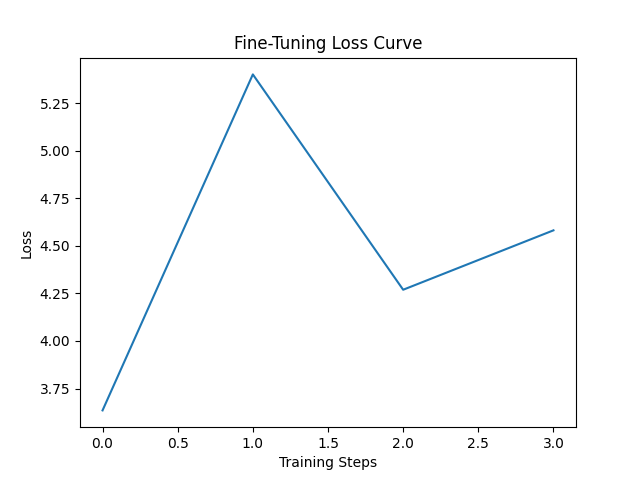

## Project Overview

- **Goal**: Demonstrate post-training methods (e.g., Supervised Fine-Tuning, RLHF, RAG) for adapting large language models to enterprise contexts.
- **Scope**: Build, fine-tune, and evaluate models with emphasis on accuracy, efficiency, and alignment.
- **Output**: Trained/adapted models with reproducible evaluation metrics, visualizations, and deployment notes.

---

## Contents

- `copilot_tuning_demo.ipynb` – Main demonstration notebook
- `data/` – Placeholder for dataset references
- `configs/` – Example YAML configurations for training and evaluation
- `results/` – Evaluation results and plots

---

## Methods Demonstrated

- **Retrieval-Augmented Generation (RAG)** integration
- **Supervised Fine-Tuning (SFT)** with task-specific data
- **Reinforcement Learning from Human Feedback (RLHF)** for alignment
- **Evaluation Harness** covering:
  - Task performance metrics
  - Guardrail/constraint compliance
  - Latency & cost considerations

---

## Results

### Training Loss

### Reward Comparison
[View reward_comparison.txt](reward_comparison.txt)

### Retrieval Example
See retrieval_example.txt for a sample RAG query and context.

---

## How to Run

1. Clone this repository:
    
        git clone https://github.com/crystalmford/copilot-llm-finetuning.git
        cd copilot-llm-finetuning

2. Install dependencies:
    
        pip install -r requirements.txt

3. Open the notebook:
    
        jupyter notebook copilot_tuning_demo.ipynb

---

## Key Takeaways

- Demonstrates **LLM adaptation workflows** aligned with enterprise Copilot use cases.
- Emphasizes **rapid experimentation and evaluation**.
- Provides a reproducible example of **fine-tuning and alignment techniques**.

---

## Author

**Crystal M. Ford**  
- [GitHub](https://github.com/crystalmford)  
- [LinkedIn](https://www.linkedin.com/in/crystal-m-ford/)  
- Email: crystalmford@gmail.com

